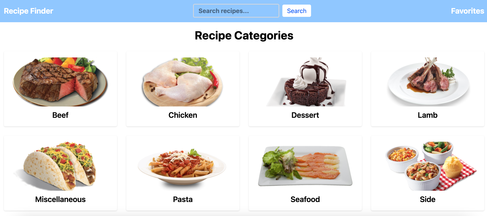
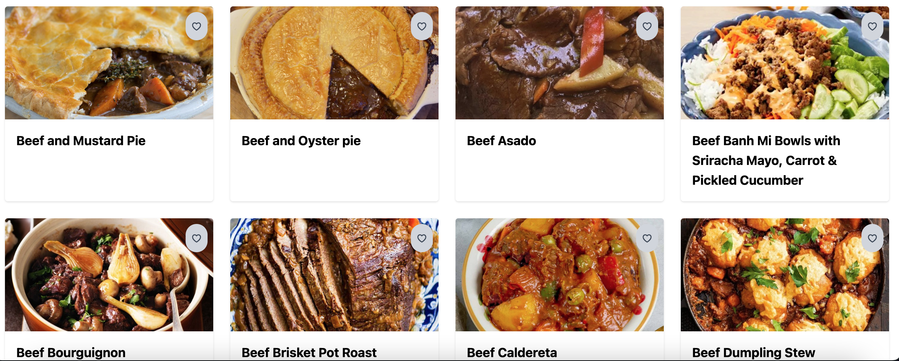
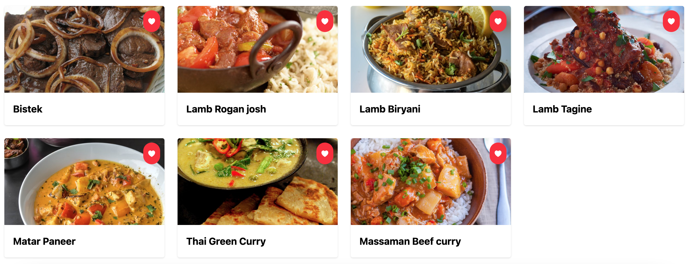

# 🥘 Recipe Discovery App

A simple recipe discovery app built with **React**, **TypeScript**, **Tailwind CSS**, and **TheMealDB API**. Users can browse recipe categories, view individual recipes, search by name, and save favorites using localStorage.


---
## 🚀 Live Deployment

[Try it on GitHub Pages!](https://yusufbolden.github.io/recipe-discovery-app/)


---
## 🚀 Local Setup & Tailwind CSS Installation

To set up and run this project locally with Tailwind CSS and Vite:

1. **Clone the repository**

```bash
git clone https://github.com/YusufBolden/recipe-discovery-app.git
cd recipe-discovery-app
```

2. **Install project dependencies**
```
npm install
```
3. **Install Tailwind CSS (with Vite)**
```
npm install tailwindcss @tailwindcss/vite
```
4. **Configure the Vite plugin**
```
// vite.config.ts
import { defineConfig } from 'vite'
import tailwindcss from '@tailwindcss/vite'

export default defineConfig({
  plugins: [
    tailwindcss(),
  ],
})
```
5. **Import Tailwind in your CSS file**
```
/* src/index.css */
@import "tailwindcss";
```
6. **Start the dev server**
```
npm run dev
```

## 📁 Project Structure

```
src/
├── components/
│   ├── ErrorMessage.tsx
│   ├── Navbar.tsx
│   ├── RecipeCard.tsx
│   └── Spinner.tsx
├── context/
|   ├── FavoritesContext.tsx
│   ├── FavoritesProvider.tsx
│   └── useFavorites.ts
├── hooks/
│   ├── useFetch.ts
│   └── useLocalStorage.ts
├── pages/
│   ├── CategoryPage.tsx
│   ├── FavoritesPage.tsx
│   ├── HomePage.tsx
│   ├── RecipeDetailPage.tsx
│   └── SearchResultsPage.tsx
├── types/
│   └── index.ts
├── assets/
│   ├── favorites.png
│   ├── recipeCategory.png
│   └── recipeHome.png
├── App.tsx
├── main.tsx
└── index.css
```
---
## 📸 Previews

### Home Page


### Category Page


### Favorites Page


## 🐞 Common Errors & Resolutions

1. Expected an assignment or function call and instead saw an expression
  - Replaced ternary side-effect with an `if/else` block

2. `err:` any throws lint error
  - Replaced `any` with `unknown` and used `instanceof Error` inside `catch`.

3. `meal.strInstructions` possibly undefined
  - Added optional chaining and a presence check before rendering instructions

4. Favorites not displaying on favorites page
  - Ensured fetch requests were awaited correctly and filtered out null meals

5. Favorite toggle button not working
  - Used onClick with toggleFavorite() and properly hooked into FavoritesContext

6. Fast Refresh error in FavoritesContext
  - Used `useState` and default context value to fix initialization issues

7. `useFavorites` undefined error
  - Confirmed that `<FavoritesProvider>` wraps the app inside `main.tsx`

8. `Spinner` and `ErrorMessage` not rendering
  - Confirmed components were used inside all loading/error conditionals

9. Fast Refresh error in `FavoritesContext`

  - Split `FavoritesContext` and `useFavorites` into separate files to comply with ESLint rules on exports.

10. TypeScript error: Object literal may only specify known properties (add/remove)

  - Ensured context interface properties match exactly with provider value properties (add and remove instead of addFavorite and removeFavorite).

11. `useFavorites` not exported from FavoritesContext

  - Exported `useFavorites` hook from a dedicated file and updated all imports accordingly.

12. Implicit 'any' type warnings in callbacks

  - Added explicit type annotations for function parameters (e.g., id: string, fav: string, r: any).

13. LocalStorage usage missing useEffect for synchronization

  - Added useEffect to synchronize storedValue changes with localStorage.

14. ESLint no-unused-expressions warning in toggleFavorite

  - Replaced ternary operator with an explicit if/else block to ensure clear side effects.

---

## 🧠 Reflection

### 🔥 The challenges you encountered and how you overcame them

One major challenge was gracefully handling API loading and error states avoiding repetitive or overly complex logic inside each individual page especially around common tasks like loading states, error handling, and fetch requests. I could have accidentally duplicated logic across pages. I solved this by creating reusable components like `Spinner` and `ErrorMessage`, which simplified each page’s JSX and ensured consistent UX.

Another key difficulty was managing global state for the user’s favorite recipes. Since favorites needed to persist across sessions and pages, I had to make sure `FavoritesContext` and `useLocalStorage` hook worked well together so that the user's favorite recipes would be saved and still available after refreshing or coming back to the app. The challenge was making this context both globally accessible and reactive. I overcame this by creating a typed context, wrapping the entire app with `FavoritesProvider`, and testing flow across all pages.

Ternary expressions inside functions triggered ESLint errors, specifically when used for side effects (e.g., adding/removing favorites). I resolved this by replacing ternary expressions with clean if/else blocks, which also made the logic more readable and maintainable.

During development, managing the React Context with TypeScript and ensuring proper Fast Refresh behavior was a major challenge. The ESLint rule requiring files to export only components forced us to split the Favorites context and hook into separate files. I also tackled persistent TypeScript typing issues around state updater functions by explicitly defining callback parameter types. These issues were resolved through careful interface alignment and refactoring, improving both type safety and developer experience. Additionally, syncing localStorage with state using useEffect helped maintain persistent favorites without stale data.

### 🧩 Design decisions and how they shaped the project

To simplify data fetching and avoid repetitive logic, I created a generic `useFetch` hook. It takes care of the loading, error, and data states so I don’t have to write the same code on every page. All are kept neatly in one place, and supports custom types via TypeScript generics. This made each page cleaner and easier to debug.

I used `useLocalStorage` as a custom hook to sync favorites with `localStorage` while also updating React state. This decision ensured that the app’s data layer worked seamlessly with browser storage and avoided unnecessary re-renders.

Routing was structured using React Router dynamic routes (/category/:name, /recipe/:id, /search?query) so the page links are clear and easy to understand. This also helps users know what to expect when clicking or sharing a link. Each route loads only what it needs, keeping pages fast and easy to use. Components like `RecipeCard` were designed to be reusable across `categories`, `favorites`, and search results with a consistent prop shape.

I switched from BrowserRouter to HashRouter to ensure the app works smoothly when deployed on GitHub Pages, which does not support dynamic server-side routing. HashRouter uses URL hashes to manage client-side routes, preventing 404 errors on page refresh or direct URL access. This choice simplifies deployment without needing additional server configuration.

---

## 🧑🏿‍💻 Author

Created by [Yusuf Bolden](https://github.com/YusufBolden). Feedback and suggestions are welcome!

---

## 📄 License

This project is licensed under the [MIT License](https://opensource.org/licenses/MIT).
